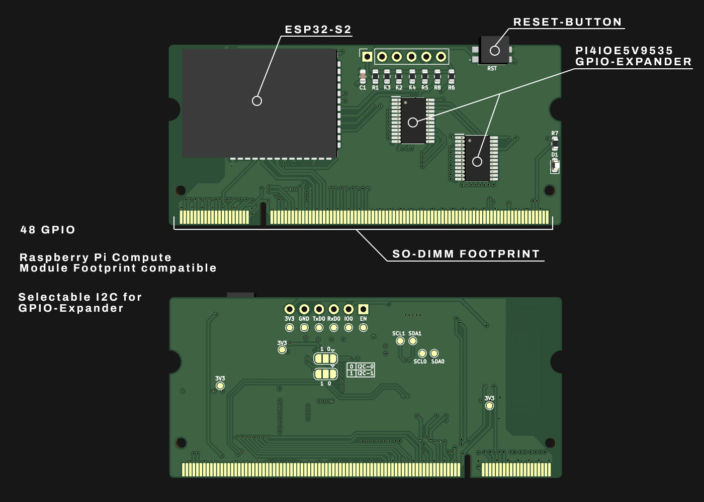
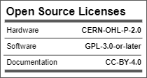
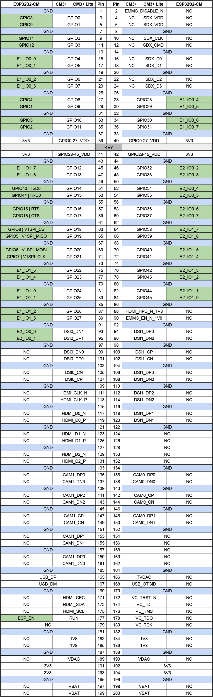

# SO-DIMM-ESP32-S2-CM

This is a ESP32-S2 based Compute Module to replace the Raspberry Pi's Compute Modules CM2 and CM3. This module is footprint compatible to the Raspberry Pi CM (SO-DIMM-DDR2). The ESP32-S2 brings USB, I2C and SPI.

Because the ESP32 is not running a Linux OS this module can not replace any CM in any project due to its limitations but it might helps others to reduce cost and resources needed to run the project. The ESP32-S2 consumes only 1/3 of the power the CM does. The ESP can also bring WiFi to your project if needed.

The Module also contains 2x GPIO-Expander which are used to be compatible with any GPIO of the Raspberry Pi Compute Module which gives you 48 GPIOs to be used in total.

Features:
- 2x I2C
- 2x SPI
- 1x UART
- USB

## OSHW Certified

[OSHW] DE000133 | Certified open source hardware | oshwa.org/cert

[https://certification.oshwa.org/de000133.html](https://certification.oshwa.org/de000133.html)

## GPIO Reference

GPIO Expander references E1_IOX_Y = < Expander >_< Bank >_< GPIO >
Example: E1_IO0_2 is the GPIO 2 of the Bank 0 in GPIO Expander 1. GPIO count starts at 0.

GPIO Expander E1 has address 0x20
GPIO Expander E2 has address 0x21

